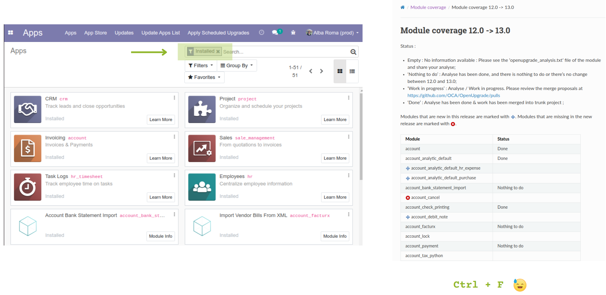

</style></head><body><article id="1200b6da-0733-4eda-8c1e-8feda7bade75" class="page sans"><header><h1 class="page-title">Odoo MIGRATIONS</h1></header>

<strong>OCA/OpenUpgrade</strong>

<em>To run migrations across multiple versions, you need to run each version of OpenUpgrade in order 😅</em>
<ol type="1" id="ce14b868-4a72-4871-be7f-15f4ce2507bb" class="numbered-list" start="1"><li><em>Check coverage of the migration scripts for your installed modules</em></li></ol>
<em>If there are modules for which no migration scripts have been developed yet, your migration may fail or the integrity of your database may be lacking. </em>

Activate the developer mode, go to Apps and filter by Installed. manually check the names (in pink) on the list of modules available for migration (<a href="https://oca.github.io/OpenUpgrade/status.html">https://oca.github.io/OpenUpgrade/status.html</a>) Uninstall those modules which do not apear on the list or are marked as ‘Empty’/’Work in progress’. This is because there are no migration scripts available in the current OpenUpgrade.
<figure id="3a23ba69-2241-45f2-9a75-87b638555295" class="image"></figure><ol type="1" id="0c8fb14e-c906-4be6-a2f6-f76f0ca93e2d" class="numbered-list" start="2"><li><em>Do a backup of the current database (as a zip)</em></li></ol><ol type="1" id="12a32513-cd68-4896-b62e-b57dfebf7eaa" class="numbered-list" start="3"><li><em>Prepare migration environment →</em> </li></ol>
Clone the odoo-migration repository from git in order to proceed with the migration steps: <a href="https://github.com/albieta/odoo-migration">https://github.com/albieta/odoo-migration</a>. You will have 4 odoo projects ready with the necessary openupgrade scripts prepared. 
<figure id="c4619b21-d16f-4665-a0c7-03e552f3f862" class="image"></figure><ol type="1" id="fed7e799-a9b3-422c-aa85-a764c4ad8539" class="numbered-list" start="4"><li><em>Migration from v12 to v13</em></li></ol>
If you already prepared a backup as described in step 1. you can proceed by bringing up the <strong><em>odoo-v13</em></strong> with the docker-compose. 

Open <a href="http://localhost:8069/web/database/selector">http://localhost:8069</a> and choose to <strong>restore a database</strong>. Upload the zip from the backup of version 12. The following warning will apear as the version of the database is not compatible. 
<figure id="0e2c288d-19c0-470d-a3ac-b2ee764c1962" class="image"></figure>
Now enter the bash of the odoo running container, and from there →

 <code>cd /mnt/extra-addons/OpenUpgrade13</code>

 <code>./odoo-bin --database=[database name] --config=/etc/odoo/odoo.conf --update all --stop-after-init</code>

Reloading the odoo url, now the warning should be gone →
<figure id="16f0088c-a09e-4753-9148-14dd1d8e9a4e" class="image"></figure>
You could click on it and check everything should have migrated correctly. 

Proceed with doing a backup of this current database so you have a zip in version 13. 
<ol type="1" id="6ce3c0ee-1e9a-452d-bf56-a851cd98396b" class="numbered-list" start="5"><li><em>Migration from v13 to v14 and v14 to v15 (same procedure)</em></li></ol>
Run now the docker-compose for odoo v14, restore the database from the v13 zip. Same warning will apear. Go to the bash from the odoo container again, and from there →

<code>cd /var/lib/odoo</code>

<code>odoo -d [name database] -u all --stop-after-init</code>

Once the upgrade is finished, reload the odoo url and check everything should be fine. 

Do a backup for this version 14 and repeat the exact same steps with odoo-v15. 

<strong><em>You should be ready to go :) </em></strong>

</article></body></html>